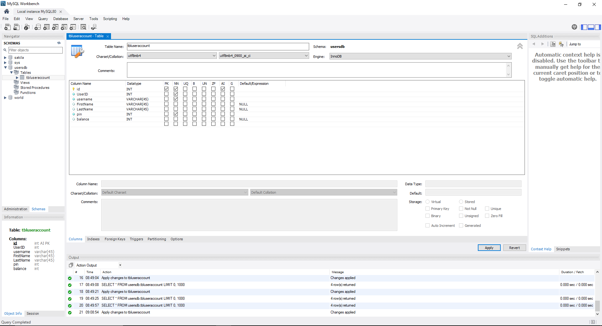

# ATM C# Project

This is a console-based application simulating an ATM's' menu options. With this project, I had 3 main goals:

- Create my first C# program and familiarize myself with the sytatx
- Introduce myself to MySQL and the interactions between a program and an external database
- Attempt to properly implement and familiarize myself with the SOLID principles

## Dependencies
This project utilizes some additional projects and librarys:

- [Autofac](https://github.com/autofac/Autofac)
- [Dapper](https://github.com/DapperLib/Dapper)
- [MySQL.data](https://www.mysql.com/)
- [Database Access Library](https://github.com/kjzamora/DatabaseAccessLibrary)

## MySQL Setup

This project will utilize a locally hosted MySQL database

To Setup the MySQL database:

- Intsall MySQL
- Run installer and install by selection using developers install option
- [Reference Video](https://www.youtube.com/watch?v=WuBcTJnIuzo)

### My Default Credentials for this project
- MySQL root 
- pass: SQLpass

### My Default MySQL Account:
MySQL user account:
- user: DBAdmin
- pass: admin

### Continuing Installation:
hit next/accept defaults everywhere else

### Initialization:
GUI: Database -> Connect to database ->
	Select stored connection -> Local instance MySQL router
	password -> store in vault -> MySQL root pass

### Table Setup

Two tables will be created for this: tbluseraccount & tbladminaccount:

  

